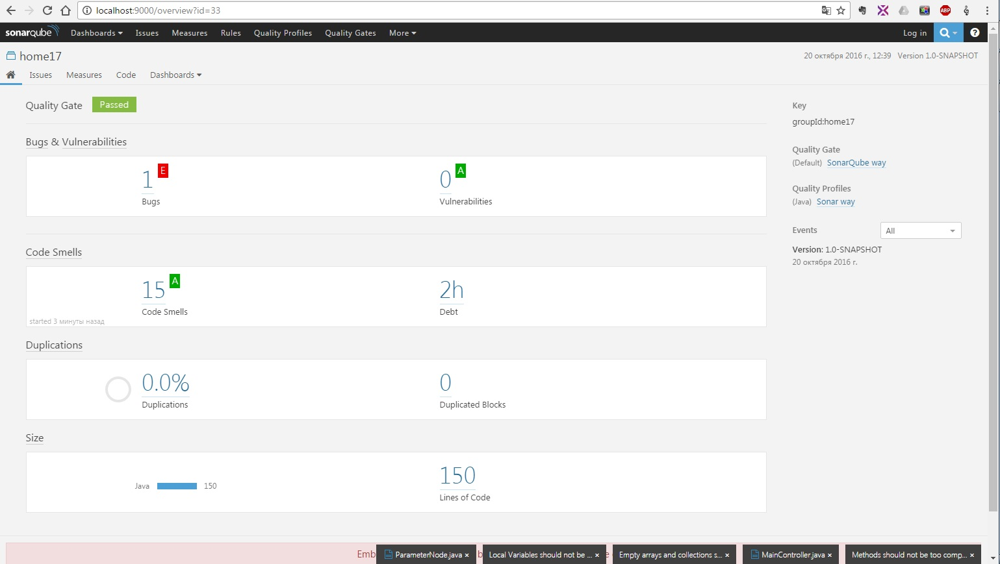
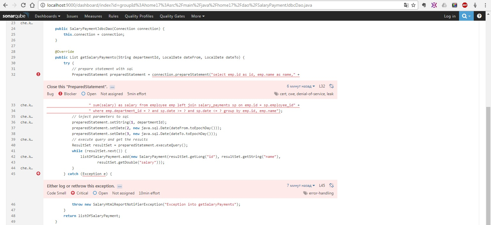
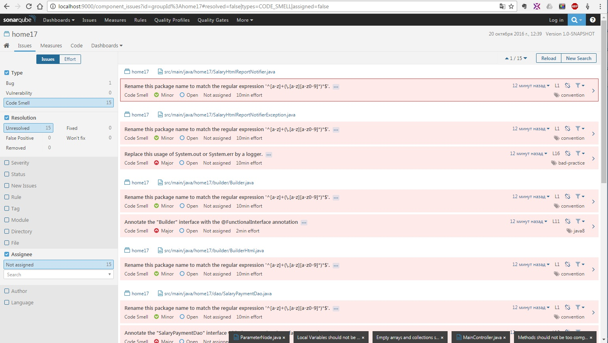
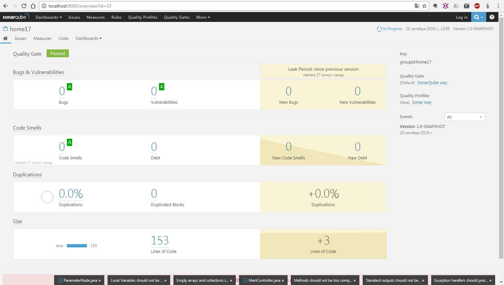

###**Задание к уроку N21 (Development process)**

1 Установить SONAR  
2 Снять статистику со своего проекта, сформировать скриншоты с пояснениями   

***Реализация***

Для проверки использовался модуль home17  
https://github.com/sbt-java-school/KonstantinTrotsenko/tree/master/home17  

   
Первая проверка показала что есть один баг (не закрыт PreparedStatement)  
   
И имелись недочеты: неверное имя пакета, неверная проброска исключения,  
необходимость указания интрефейса как функционального   
   
После исправления всех ошибок и недочетов была проведена новая проверка,  
которая не выявила ничего.  
       

***Итог***

1 Установил Sonar, научился им пользоваться. В течение послудующей разработке  
буду использовать, чтобы выявить статистику прогресса.  

